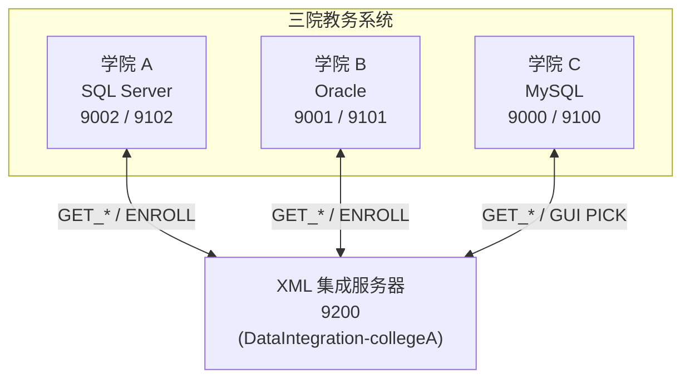
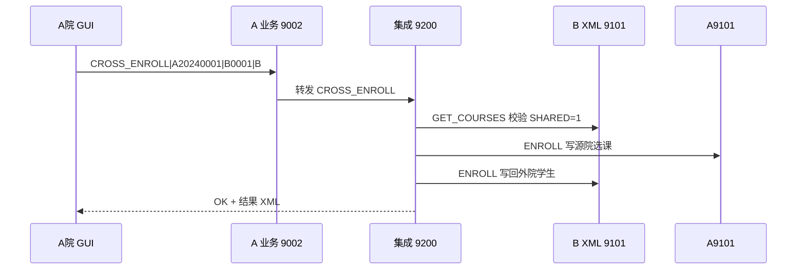
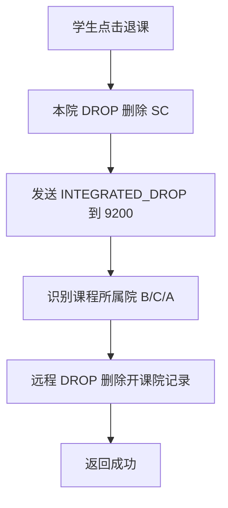
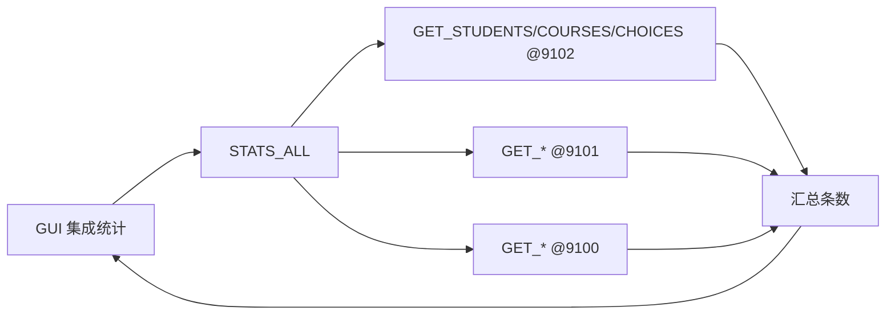

# 作业3 报告素材 — 学院 A + XML 集成（与 B/C 联调版）

## 1. 总体架构

## 2. 跨院选课

## 3. 集成退选

## 4. 全院统计

## 5. 技术说明（报告正文可用）

1. **XML 交换**：各院 `XmlTcpServer` 导出本地 schema 的 XML，经 XSD 校验后供集成服务器使用。
2. **XSL 映射**：`studentA_to_unified.xsl` 等将异构字段转为 `formatStudent.xsd` 统一结构。
3. **异构持久化**：学院 A 使用 SQL Server 表 `Student/Course/SC/Account`，字段命名与 Oracle/MySQL 院不同。
4. **写回机制**：跨院选课后集成服务器对**源院**与**开课院**分别调用 `ENROLL`（C 院使用 GUI `PICK`）。
