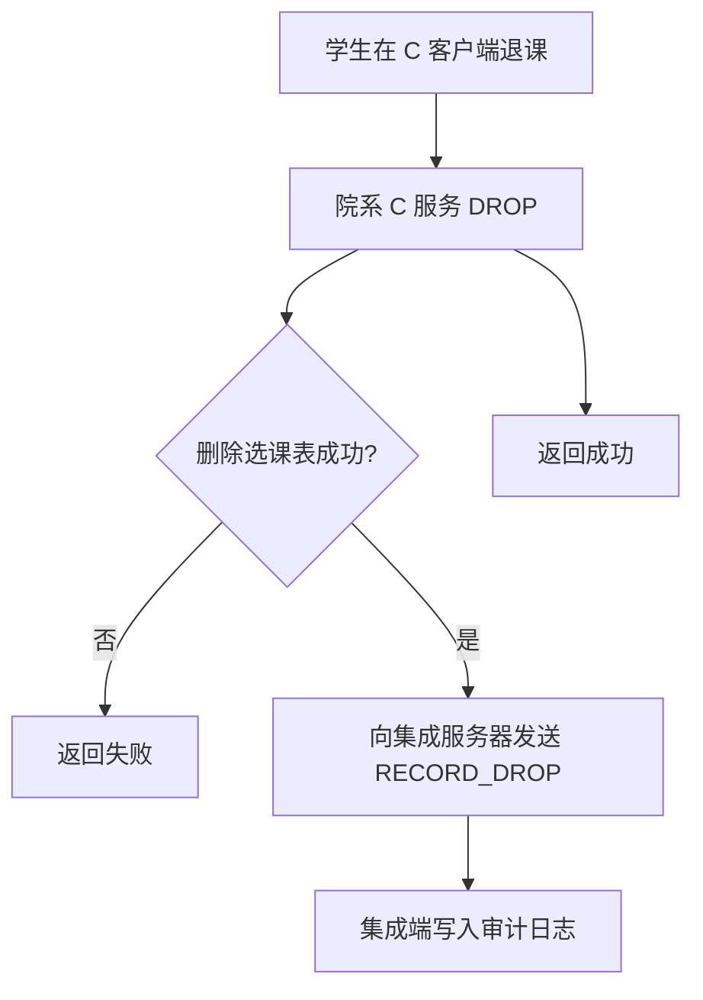
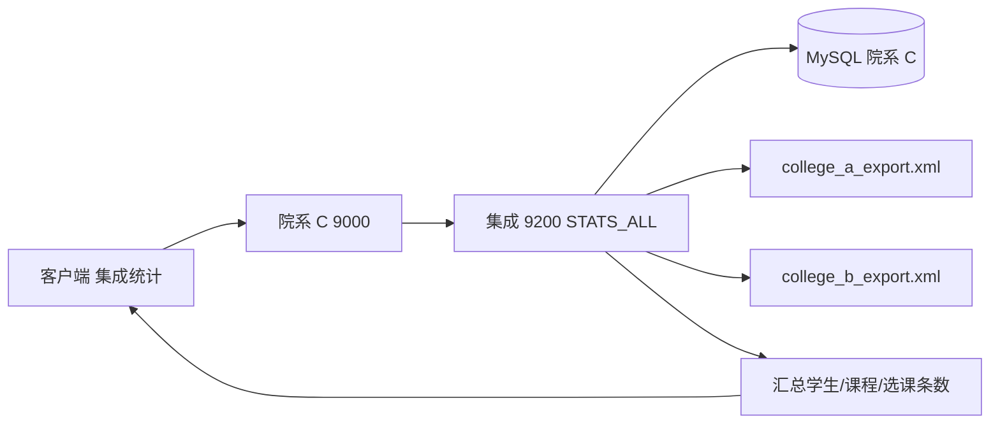

# 基于 XML 的集成教务系统 — 院系 C 与集成端（同学 3）

本仓库实现**院系 C（MySQL）**侧：建库与示例数据、**Swing GUI + 登录**、**XMLServer**（导出 XML + XSD 校验）、以及**集成服务器**上的 **XSL 转换**、**全院统计**与退课后的**集成端登记**。可与课件《基于 XML 数据集成的集成教务系统示例》对照阅读。

---

## 技术栈

| 组件 | 说明 |
|------|------|
| Java 11+ | 业务、网络、Swing GUI |
| Maven | 构建与依赖 |
| MySQL | 院系 C 数据库 |
| DOM4J | 从 JDBC 结果集生成 XML |
| JAXP (`javax.xml.transform`) | XSLT 转换 |
| JAXP (`javax.xml.validation`) | XSD 校验 |
| JUnit 5 | 单元测试（XSLT 样例） |

---

## 目录结构（核心）

```
DataIntegration/
├── pom.xml
├── sql/
│   ├── 01_schema.sql      # 建库建表（college_c_edu）
│   └── 02_seed.sql        # 示例数据：管理员、10 门课、50 学生、每人 5 门选课
├── README.md              # 本说明
└── src/main/
    ├── java/cn/nju/dataintegration/
    │   ├── collegec/      # 院系 C：应用入口、GUI、TCP、Repository、XML 导出/校验
    │   ├── integration/   # 集成服务器：统计、XSLT、TCP
    │   ├── config/        # application.properties 读取
    │   ├── db/            # JDBC 连接
    │   └── net/           # 文本/XML 分帧协议
    └── resources/
        ├── application.properties
        ├── xsd/college-c/         # 院系 C：学生/课程/选课 XSD
```

---

## 数据库说明

- **库名**：`college_c_edu`
- **表**：`account`（管理员）、`student`、`course`、`sc`（选课；避免使用保留字 `select` 等作表名）
- **规模**：50 名学生、10 门课程、每名学生 5 条选课记录（与作业要求一致）
- **执行顺序**：先 `01_schema.sql`，再 `02_seed.sql`（种子数据使用存储过程，兼容 MySQL 5.7+）

### 默认账号（种子数据）

| 角色 | 账号 | 密码 |
|------|------|------|
| 学生示例 | `C20240001` | `000000` |
| 管理员 | `admin` | `admin888888` |

---

## 配置

编辑 `src/main/resources/application.properties`：

| 键 | 含义 |
|----|------|
| `db.url` | JDBC URL（含库名、时区、编码等） |
| `db.user` / `db.password` | MySQL 账号 |
| `college.c.gui.port` | 院系 C 业务 TCP（默认 **9000**，GUI 客户端连接） |
| `college.c.xml.port` | XMLServer（默认 **9100**） |
| `integration.server.port` | 集成服务器（默认 **9200**） |

---

## 运行方式

### 前置条件

1. 已安装 **JDK 11+**（当前 `pom.xml` 默认 `release=11`，若本机为 JDK 17 可自行改为 `17`）
2. 已安装 **MySQL**，并已执行 `sql/` 下脚本
3. `application.properties` 中数据库配置正确

### 启动院系 C + 集成端（推荐）

**方式一：Maven 一行启动（已配置 `exec-maven-plugin`）**

在仓库根目录 `DataIntegration` 下执行：

```powershell
cd d:\codes\DataIntegration
mvn -q compile exec:java
```

会启动集成端（9200）、院系 C 业务（9000）、XMLServer（9100），并弹出 Swing 登录窗口。

**方式二：IDE**

1. 用 IntelliJ IDEA / Eclipse / VS Code 以 **Maven 项目** 打开 `DataIntegration`。
2. 找到主类 `cn.nju.dataintegration.collegec.CollegeCApplication`。
3. 右键 **Run** / **Debug**。

同一进程内会启动：

1. **集成服务器**（端口见 `integration.server.port`）
2. **院系 C 业务服务**（GUI 协议）
3. **XMLServer**（集成拉数/校验）
4. **Swing 登录窗口**

主类全名：`cn.nju.dataintegration.collegec.CollegeCApplication`。

### 仅启动集成服务器

**Maven：**

```powershell
mvn -q compile exec:java -Dexec.mainClass=cn.nju.dataintegration.integration.IntegrationApplication
```

**IDE：** 运行 `cn.nju.dataintegration.integration.IntegrationApplication`。

进程会长期阻塞；结束需 Ctrl+C 或结束 Java 进程。

### Maven 构建与测试

```bash
mvn clean test
```

```bash
mvn clean package
```

说明：`package` 生成的 JAR **未**打全依赖，不能直接 `java -jar` 单机运行；日常请用 **`mvn compile exec:java`** 或 IDE 运行主类。若需要可分发的一键 JAR，可自行增加 `maven-shade-plugin`。

---

## 网络协议摘要

### 1. 院系 C 业务端口（GUI → `CollegeCTcpServer`）

单行命令，响应为：`OK` + `<XMLBEGIN>` + 正文 + `<XMLEND>`（错误行为 `ERR|消息`）。常用命令：

| 命令 | 说明 |
|------|------|
| `LOGIN\|账号\|密码` | 返回正文 `STUDENT\|学号` 或 `ADMIN\|账号` |
| `LIST_COURSES` | 多行 `字段\|...`，每行一门课 |
| `MY_SC\|学号` | 当前选课 |
| `PICK\|学号\|课程号` | 选课（最多 5 门、重复会失败） |
| `DROP\|学号\|课程号` | 退课；成功后会向集成端发 `RECORD_DROP` |
| `STATS_LOCAL` | 管理员：本院学生/课程/选课条数 |
| `INTEGRATED_STATS` | 转发集成端 `STATS_ALL` 的全院汇总文本 |

### 2. XMLServer（`XmlTcpServer`）

每连接发送一行：

| 命令 | 行为 |
|------|------|
| `GET_STUDENTS` | 导出学生 XML，并按 `studentC.xsd` 校验 |
| `GET_COURSES` | 导出课程 XML，并按 `classC.xsd` 校验 |
| `GET_CHOICES` | 导出选课 XML，并按 `choiceC.xsd` 校验 |

### 3. 集成服务器（`IntegrationTcpServer`）

| 命令 | 行为 |
|------|------|
| `STATS_ALL` | 汇总：MySQL 院系 C + classpath 中 A/B 示例 XML |
| `RECORD_DROP\|学号\|课号` | 退课审计：追加到系统临时目录下 `integration-drop-audit.log` |
| `DEMO_XSL_STUDENT` | 演示库内 3 名学生经 C→统一→C 的 XSL 往返（需 DB 可用） |

---

## XSD / XSL 清单（同学 3 负责部分）

### 院系 C 本地 XSD（4 个）

| 文件 | 用途 |
|------|------|
| `xsd/college-c/studentC.xsd` | 校验 `GET_STUDENTS` 导出 |
| `xsd/college-c/classC.xsd` | 校验 `GET_COURSES` 导出 |
| `xsd/college-c/choiceC.xsd` | 校验 `GET_CHOICES` 导出 |

### 集成端统一 XSD（3 个）

| 文件 | 用途 |
|------|------|
| `integration-server/src/main/resources/xsd/integration/formatStudent.xsd` | 统一学生结构 |
| `integration-server/src/main/resources/xsd/integration/formatClass.xsd` | 统一课程结构 |
| `integration-server/src/main/resources/xsd/integration/formatChoice.xsd` | 统一选课结构 |

### 院系 C 相关 XSL（4 个，部署在集成端逻辑目录）

| 文件 | 方向 |
|------|------|
| `integration-server/src/main/resources/xsl/integration/studentC_to_unified.xsl` | C 本地学生 → 统一 |
| `integration-server/src/main/resources/xsl/integration/unified_to_studentC.xsl` | 统一 → C 本地学生 |
| `integration-server/src/main/resources/xsl/integration/classC_to_unified.xsl` | C 本地课程 → 统一（`id` 与 `Cno` 的 9 位规则见 XSL 内注释） |
| `integration-server/src/main/resources/xsl/integration/unified_to_classC.xsl` | 统一 → C 本地课程 |

---

## 报告用流程图（Mermaid）

### 集成环境下退课（本实现）



### 集成统计（本实现）



说明：A/B 当前为 **resources** 下示例统一 XML；与同学 1/2 联调时可替换为真实导出或改为网络拉取。

---

## 与全组系统的衔接说明

- **课程共享 / 跨院系选课写回对方库** 依赖其他同学的客户端、网络框架与 A/B 库；本仓库提供 **C 端完整闭环** 与 **集成端统计、XSL、退课登记** 的可运行实现。
- 集成统计由独立 `integration-server` 实时访问 A/B/C XML 端口，不再使用离线 sample XML。

---

## 常见问题

1. **启动报数据库连接失败**  
   检查 MySQL 是否启动、`application.properties` 中 URL/账号/密码、以及是否已建库执行脚本。

2. **「集成统计」失败**  
   确认 `CollegeCApplication` 已启动集成线程（默认与 GUI 同进程），且 9200 未被占用。

3. **Java 版本**  
   `mvn clean test` 使用 `pom.xml` 中的 `release`；若编译器只支持更低版本，请安装 JDK 11 或按环境修改 `release`。

---
