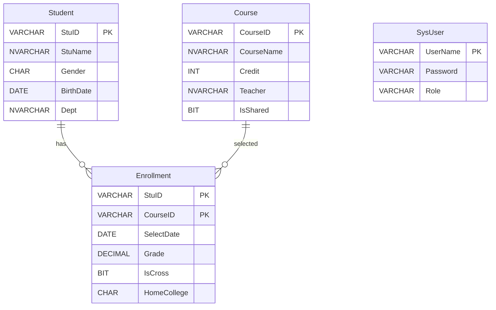
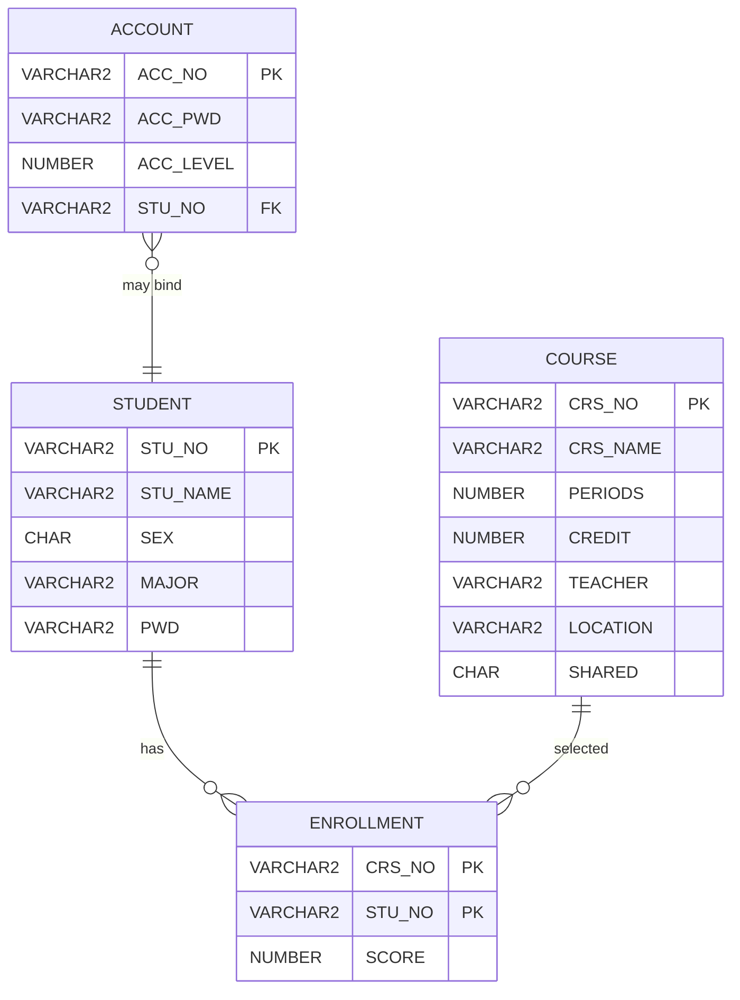
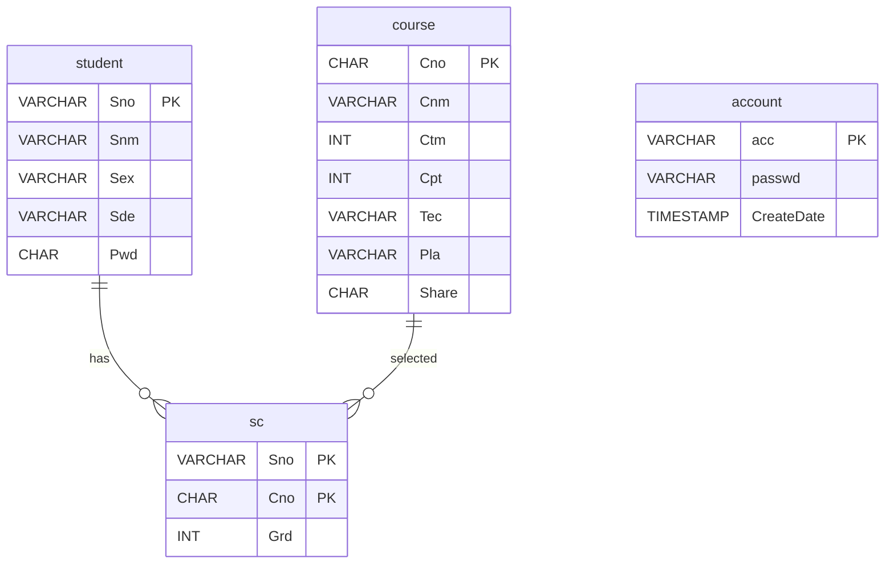
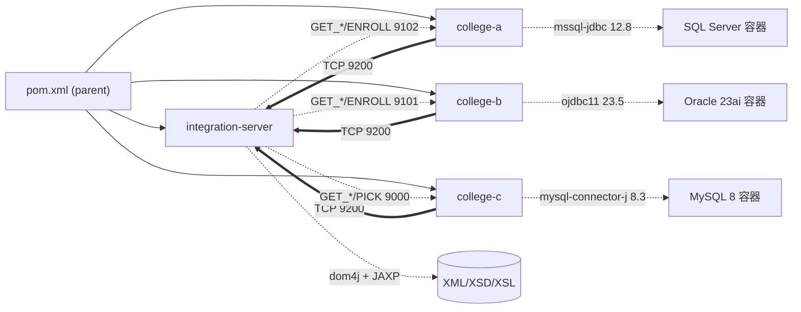
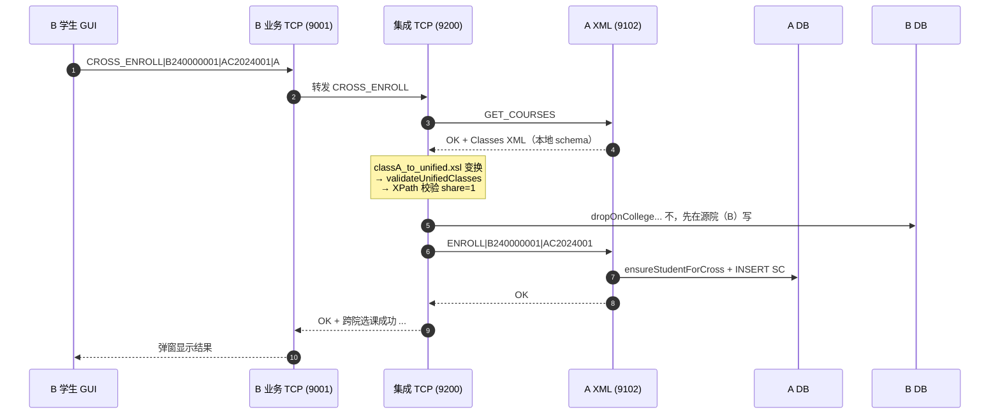
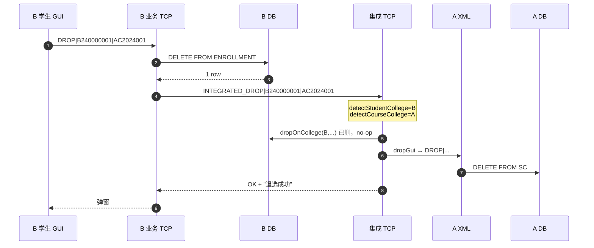
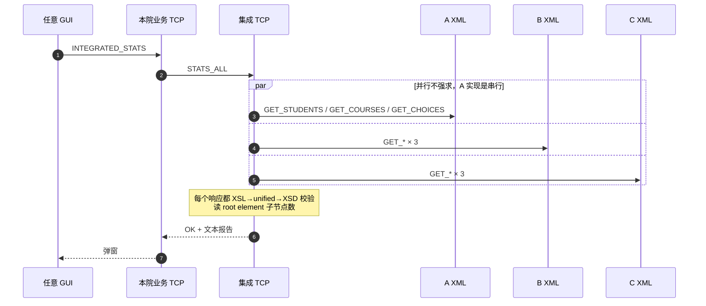

# 基于 XML 数据集成的异构教务系统 — 课程作业 3 报告

**南京大学 / 数据集成 / 三人组**

> 草稿版。**斜体加粗 (***待补***)** 标记需要补的内容（截图 / 表格数据 / 团队签名 / 测试记录）。

---

## 1. 项目概述

### 1.1 题目背景

教育领域的数据集成是 XML 数据集成的经典场景：不同学院的教务系统通常各自独立建设、各自选型 DBMS，但在跨院选课、统一统计等业务上又需要协作。课本《数据集成原理》3.5 节给出了一个三学院（A/B/C）的最小可运行实例，本作业即沿用该场景的需求假设，独立完成集成系统的设计与实现。

### 1.2 团队分工

| 同学 | 学号 | 模块 | 主要工作 |
|---|---|---|---|
| ***待补*** | ***待补*** | college-a（SQL Server） + integration-server | A 院 DB schema/seed、Repo/GUI；集成服务器主框架（IntegrationTcpServer / CrossEnrollService / StatsAggregator / RemoteCollegeClient / XsltTransformer）；A/B/C 三向 XSL 全套；报告流程图骨架 |
| ***待补*** | ***待补*** | college-b（Oracle）；integration-server 的 XmlValidator 子组件 | B 院 DB schema/seed、Repo/GUI；XSD 校验组件 XmlValidator（被集成服务器 StatsAggregator 调用）；B↔规范格式 XSL |
| ***待补*** | ***待补*** | college-c（MySQL） | C 院 DB schema/seed、Repo/GUI；首版 XmlFrameProtocol（A/B 复用）；首版规范格式 XSD；JUnit XSL 往返测试 |
| 全员 | — | 合并 + 联调 + 报告 | 接口对齐（CROSS_ENROLL / INTEGRATED_DROP / ensureStudentForCross）；Maven 多模块聚合；集成服务器拆分为独立模块 |

代码仓库：`integrated-edu/`（GitHub URL ***待补***）

---

## 2. 需求分析

题目原文（节选自《作业要求》）：

1. 三个学院 A/B/C，DBMS 分别为 SQL Server / Oracle / MySQL。各自管理 50 学生、10 课程，每生选 5 门。学生集合互不覆盖，课程信息有重叠。
2. 通过 **集成服务器** 实现共享课程的跨学院选课：学生从外学院共享课程中选课后，要把学生信息和选课信息 **写回** 课程所在的本院数据库。
3. 集成服务器统计所有学院的学生、课程、选课信息。
4. 集成环境下支持学生退选课程的完整流程。
5. 一律采用 XML 作为跨系统交换格式。三个院都要有 GUI 和登录。

> 解读：需求 1 是"异构"——刻意要求三种 DBMS 和三种字段命名；需求 2 是"跨系统写"——集成不能只读；需求 3+4 必须由集成服务器协调；需求 5 要求 XML 走通端到端（XSD 校验 + XSL 变换 + 帧协议）。

---

## 3. 数据库设计

### 3.1 三院字段对照

| 概念 | 院 A (SQL Server) | 院 B (Oracle) | 院 C (MySQL) | 规范格式（unified） |
|---|---|---|---|---|
| 学号 | `Student.StuID` VARCHAR(9) | `STUDENT.STU_NO` VARCHAR2(9) | `student.Sno` VARCHAR(9) | `<id>` (xs:string) |
| 学号前缀 | `A` | `B` | `C` | — |
| 学生姓名 | `StuName` VARCHAR(10) | `STU_NAME` VARCHAR2(10 CHAR) | `Snm` VARCHAR(10) | `<name>` |
| 性别 | `Gender` CHAR(1) | `SEX` CHAR(1) | `Sex` VARCHAR(1) | `<sex>` |
| 专业/院系 | `Dept` VARCHAR | `MAJOR` VARCHAR2(16 CHAR) | `Sde` VARCHAR(6) | `<major>` |
| 密码 | — | `PWD` VARCHAR2(6) | `Pwd` CHAR(6) | — |
| 课号 | `Course.CouID` VARCHAR(9) | `COURSE.CRS_NO` VARCHAR2(5) | `course.Cno` CHAR(4) | `<id>` (9 位规范长度) |
| 课时 | `Cou_period` INT | `PERIODS` NUMBER(3) | `Ctm` INT | `<time>` xs:int |
| 学分 | `Cou_credit` INT | `CREDIT` NUMBER(1) | `Cpt` INT | `<score>` xs:int |
| 共享标志 | `Cou_share` BIT/INT | `SHARED` CHAR(1) '0/1' | `Share` ENUM/CHAR | `<share>` |
| 选课表 | `SC(StuID, CouID, Grade)` | `ENROLLMENT(STU_NO, CRS_NO, SCORE)` | `sc(Sno, Cno, Grd)` | `<choice><sid/><cid/><score/></choice>` |
| 选课表 PK | (StuID, CouID) | (STU_NO, CRS_NO) | (Sno, Cno) | — |
| 字符集 | UTF-16 (NVARCHAR 推荐) | UTF-8 + `VARCHAR2(N CHAR)` 字符语义 | utf8mb4 | UTF-8 |

> **关键异构点**：(1) 字段名完全不同；(2) 课号长度 4/5/9 不一致；(3) Oracle 字符语义需显式声明 `CHAR` 单位避免 UTF-8 中文 3 字节超长。

### 3.2 ER 图

#### 院 A（SQL Server）



#### 院 B（Oracle，化学学院）



#### 院 C（MySQL）



三院共同特征：1 个学生表 + 1 个课程表 + 1 个选课关系表，选课表均用复合主键 (学号 PK + 课号 PK)。异构点全在字段命名 / 类型 / 字符集 / 课号长度上，见 §3.1 对照表。

### 3.3 共享课定位

每院 10 门课程里前 3 门标记为共享（`Cou_share/SHARED/Share = 1`）。跨院选课只能选目标院里 `share=1` 的课。集成服务器在 `CrossEnrollService.isSharedOnCollege` 中用 XPath `//Classes/class[id=$cid]/share` 检查。

---

## 4. XML 集成方案

### 4.1 总体架构


### 4.2 协议设计 — `XmlFrameProtocol`

最简单的行协议 + XML 帧：

```
请求方:    <CMD>|<arg1>|<arg2>...\n
响应方OK:  OK\n<XMLBEGIN>\n<payload>\n<XMLEND>\n
响应方ERR: ERR|<message>\n
```

ENROLL 写回因为只回执行结果，简化为 `OK\n`（无 XML 帧）。

### 4.3 命令清单

**院系 TCP（业务）端口**（三院命令一致，端口分别 9002/9001/9000）：

| 命令 | 入参 | 出参 | 备注 |
|---|---|---|---|
| `LOGIN` | sno/admin, pwd | STUDENT\|sno 或 ADMIN\|admin | |
| `LIST_COURSES` | — | 多行 `cno\|name\|...` | |
| `MY_SC\|sno` | — | 多行 `sno\|cno\|score\|name` | |
| `PICK\|sno\|cno` | — | OK 或 FAIL | 上限 5 门 + 复合 PK 唯一 |
| `DROP\|sno\|cno` | — | OK 或 FAIL | 同时发 INTEGRATED_DROP 给 9200（合并阶段修正） |
| `STATS_LOCAL` | — | `stu#\|course#\|enroll#` | |
| `INTEGRATED_STATS` | — | 转发 STATS_ALL 给 9200 | |
| `CROSS_ENROLL\|sno\|cno\|target` | — | 转发给 9200 | C 在合并阶段补齐 |

**院系 XML 端口**（三院一致，端口分别 9102/9101/9100）：

| 命令 | 出参 | 用于 |
|---|---|---|
| `GET_STUDENTS` | `Students` XML（本地 schema） | 集成统计 + 跨院校验 |
| `GET_COURSES`  | `Classes` XML | 共享课定位 |
| `GET_CHOICES`  | `Choices` XML | 统计 |
| `ENROLL\|sno\|cno` | OK / ERR | 跨院选课写回（A/B 走此命令；C 由集成层走 GUI PICK） |

**集成服务器端口 9200**：

| 命令 | 实现位置 | 说明 |
|---|---|---|
| `STATS_ALL` | `StatsAggregator.buildAllCollegesReport` | 三院汇总 |
| `CROSS_ENROLL\|sno\|cno\|target` | `CrossEnrollService.crossEnroll` | 共享判定 + 双向写回 |
| `INTEGRATED_DROP\|sno\|cno` | `CrossEnrollService.integratedDrop` | 源院 + 开课院双删 |
| `RECORD_DROP\|sno\|cno` | 兼容老接口，仅写审计日志 | 合并后已基本被 INTEGRATED_DROP 取代 |

### 4.4 规范（unified）XML 格式

三类对象统一为：

```xml
<Students>
  <student>
    <id>...</id><name>...</name><sex>M|F</sex><major>...</major>
  </student>
</Students>

<Classes>
  <class>
    <id>9 位规范课号</id><name/><time xs:int/><score xs:int/>
    <teacher/><location/><share>0|1</share>
  </class>
</Classes>

<Choices>
  <choice><sid/><cid/><score xs:int/></choice>
</Choices>
```

XSD 文件放在 `src/main/resources/xsd/integration/format{Student,Class,Choice}.xsd`。三模块各持一份，**内容必须逐字一致**（合并时 diff 已确认 byte-identical 除行末符）。

### 4.5 各院本地 XSD

| 院 | 路径 | 文件 |
|---|---|---|
| A | `college-a/src/main/resources/xsd/college-a/` | `studentA.xsd`、`classA.xsd`、`choiceA.xsd`（A 院 SysUser 表不走 XML，故无 accountA.xsd） |
| B | `college-b/src/main/resources/xsd/college-b/` | `studentB.xsd`、`classB.xsd`、`choiceB.xsd`、`accountB.xsd` |
| C | `college-c/src/main/resources/xsd/college-c/` | `studentC.xsd`、`classC.xsd`、`choiceC.xsd`、`accountC.xsd` |
| 集成服务器 | `integration-server/src/main/resources/xsd/integration/` | `formatStudent.xsd`、`formatClass.xsd`、`formatChoice.xsd`（规范格式，跨院唯一事实源） |

`DomXmlExporter` 用 `ResultSetMetaData.getColumnLabel()` 自动用列名作 XML 元素名，所以 XSD 元素名即列名。

各院 `XmlSchemaValidator` 在 `GET_STUDENTS/COURSES/CHOICES` 响应前对自家 XML 做本地 XSD 校验，校验失败回 `ERR|...`。集成服务器侧的 `XmlValidator`（Student 2 提供）在收到院系 XML 并经 XSL 变换为规范格式后再次校验，双层把关。

### 4.6 XSL 双向映射

每院都有 `studentX_to_unified.xsl` / `classX_to_unified.xsl` / `choiceX_to_unified.xsl`；A 院因为持有集成服务器，还额外持有 B/C 三套同名 XSL（统一放 A 模块 classpath，因为 XSL 在集成服务器进程里加载）。

关键技巧：**课号长度对齐**。规范格式课号 9 位，本地 B 是 5 位、C 是 4 位。

```xslt
<!-- classB_to_unified.xsl: 5 位 → 9 位左补零 -->
<xsl:template match="course">
  <class>
    <id><xsl:value-of select="concat('0000', CRS_NO)"/></id>
    ...
  </class>
</xsl:template>

<!-- unified_to_classB.xsl: 9 位 → 5 位右截 -->
<id><xsl:value-of select="substring($id9, string-length($id9) - 4)"/></id>
```

C 院类似，`concat('00000', Cno)` 把 4 位补到 9 位。

性别字段三院都用 `M/F` 值域，无需 XSL 映射。共享标志 `0/1` 字符串值域也一致。

---

## 5. 系统实现

### 5.1 模块依赖图



父 pom 用 `<dependencyManagement>` 统一 `dom4j` / `jaxen` / `JUnit` 版本。`integration-server` 模块**不**依赖任何 JDBC 驱动，只走 TCP/XML 通道与三院通信。各子模块只声明 `groupId+artifactId`，版本号统一在父 pom。

### 5.2 集成服务器（独立模块 integration-server）

`integration-server/src/main/java/cn/nju/dataintegration/integration/`：

- **`IntegrationApplication`** — main 入口，独立 JVM 启动
- **`IntegrationTcpServer`** — 端口 9200，命令路由（一个 switch）
- **`CrossEnrollService`** — `crossEnroll` 与 `integratedDrop` 的核心实现，靠学号前缀判定源院，靠课号长度/前缀判定开课院（`detectStudentCollege` / `detectCourseCollege`）
- **`StatsAggregator`** — `buildAllCollegesReport` 串行调用三院 XML 端口，每次响应都过 XSL 变到规范格式 + XSD 校验，最后汇总条数
- **`XsltTransformer`** — `javax.xml.transform.Transformer` 的薄封装
- **`RemoteCollegeClient`** — 调用院系 XML 端口的客户端（`fetchXml` / `enrollXml` / `pickGui` / `dropGui`）
- **`validator/XmlValidator`** — Student 2 提供的 XSD 校验组件；被 StatsAggregator 在 XSL 变换后调用

集成服务器是与 A/B/C 平级的第四个独立 Maven 模块，**不**绑定任何 DBMS（无 JDBC 依赖），可独立部署。这次拆分（相对初版"嵌入 college-a 进程"）解决了"A 离线则集成功能整体停摆"的旧瓶颈。

### 5.3 三院 TCP 服务器

每院 `cn.nju.dataintegration.collegeX.net.CollegeXTcpServer`，模板一致：

```
ServerSocket → accept loop → new Thread(handle)
  handle 内 readLine → 按 "|" 拆 → switch 命令 → 调 Repo → 写帧
```

错误统一抛 SQLException / IOException → 顶层 catch 翻 `XmlFrameProtocol.writeErr`。

### 5.4 三院 XML 服务器

`CollegeXTcpServer` 的姐妹文件 `XmlTcpServer`，端口 9102/9101/9100。
导出 XML 走 `DomXmlExporter.exportXxx` —— 一段 JDBC 查询 + DOM4J `addElement` 循环 + `ResultSetMetaData` 取列名。
导出后立即过本地 XSD 校验（`xsd/college-X/`）。

### 5.5 GUI

每院 `gui/` 下有：
- `LoginFrame` — 单纯账号/密码框 + LOGIN
- `MainFrame` — JTable 显示课表 / 选课表，FlowLayout 工具栏放按钮
- `CollegeXClient` — `call(cmd)` 单次 socket，统一进出口

合并阶段：C 院的 `MainFrame` 补了"跨院选课"输入框 + JComboBox(A/B) + 按钮。
B 院本来就有 JComboBox(A/C)。A 院 GUI 也有跨院选课入口。三院"退课"按钮在合并后均触发集成退课。

---

## 6. 关键流程图（作业要求 #6 必须有）

### 6.1 跨院选课时序



### 6.2 集成退课时序



### 6.3 集成统计时序



### 6.4 XSD 校验失败处理

```mermaid
flowchart TD
    R[院系 XML 端口收到 GET_*] --> E[DomXmlExporter 导出 XML]
    E --> V[XmlSchemaValidator.validate 本地 XSD]
    V -- 通过 --> OK[写 OK + XMLBEGIN/END 帧]
    V -- 抛 SAXException --> ERR[writeErr 帧, 错误信息透传]
    ERR --> CALLER[集成服务器收到 ERR<br/>放进 STATS_ALL 报告的<br/>"不可用" 行]
```

---

## 7. 测试与验证

### 7.1 单元测试

共 3 套测试，总计 11 个用例，`mvn test` 一次跑全：

| 模块 | 测试类 | 用例数 | 覆盖 |
|---|---|---|---|
| integration-server | `XmlValidatorTest` | 7 | unified Students/Classes/Choices 的正例 + 反例（缺必填元素、根元素拼错、time 非整数） |
| college-a | `XsltRoundTripTest` | 2 | `studentA_to_unified.xsl` 字段映射 + `classA_to_unified.xsl` 的 `time = Credit*16` 计算 |
| college-c | `XsltRoundTripTest` | 2 | `studentC_to_unified.xsl` 字段映射 + class 双向 roundtrip（`classC_to_unified` + `unified_to_classC`） |

跑法：

```powershell
cd integrated-edu
mvn -q test
```

期望输出（节选）：

```
Running cn.nju.dataintegration.integration.validator.XmlValidatorTest
Tests run: 7, Failures: 0, Errors: 0, Skipped: 0
Running cn.nju.dataintegration.integration.XsltRoundTripTest  (college-a)
Tests run: 2, Failures: 0, Errors: 0, Skipped: 0
Running cn.nju.dataintegration.integration.XsltRoundTripTest  (college-c)
Tests run: 2, Failures: 0, Errors: 0, Skipped: 0
BUILD SUCCESS
```

### 7.2 联调用例（手工）

| 用例 | 操作 | 期望 |
|---|---|---|
| TC1 | B 学生本院选课 / 退课 | B.ENROLLMENT 表条数变化 ±1 |
| TC2 | B 学生 → 跨院选 A 共享课 | A.SC 多一条；B 院学生 SC 也多一条（双写） |
| TC3 | C 学生 → 跨院选 B 共享课 | B.ENROLLMENT 多一条（含外院占位学生） |
| TC4 | B 学生退跨院选的 A 课 | 单击退课，B/A 两边记录都没了 |
| TC5 | 集成统计 | 弹窗"学生 150 / 课程 30 / 选课 ~750" |
| TC6 | 故意破坏 B 的 STU_NAME 字段超长 | B 端 GET_STUDENTS 回 `ERR|...`；集成统计该院显示"不可用" |

***待补：6 张截图 + 6 张 DB 查询截图 → docs/screenshots/ 目录***

### 7.3 错误处理验证

- 集成服务器（9200）离线时 → B/C 的 CROSS_ENROLL / INTEGRATED_STATS 按钮 → 弹"集成服务不可用: Connection refused"，本地操作不受影响
- 跨院选不存在的课号 / 非共享课 → 集成服务器返回"目标学院 X 不存在共享课程 Y"
- XSD 校验失败 → 见 6.4

---

## 8. 异构难点与解决

### 8.1 字段命名 / 大小写差异
SQL Server 默认大小写不敏感，Oracle 标识符默认大写、MySQL 默认按 OS（Windows 不敏感、Linux 敏感）。我们规定 **所有 JDBC SQL 都按各院 schema 严格大小写写**，并在 XSL 里用 schema 实际列名匹配。

### 8.2 课号长度统一
4 / 5 / 9 位三种长度。规范格式定 9 位 → 用 `concat('0000'/'00000', native_id)` 补零、反向 `substring` 截取，保证唯一性同时方便跨表对比。

### 8.3 字符编码
Oracle `VARCHAR2(N)` 默认 BYTE 语义，存中文（UTF-8 3 字节）易超长。我们显式写 `VARCHAR2(N CHAR)` 切换到字符语义。所有 JDBC URL 显式 `characterEncoding=utf8` / `serverTimezone=Asia/Shanghai`（MySQL）/ Oracle 通过 NLS 自动协商。Windows IntelliJ 改 UTF-8 默认带 BOM，曾导致编译器 `非法字符 ''`，统一选 "No BOM"。

### 8.4 跨院学生 FK
B/C 表 ENROLLMENT 都有 FK → STUDENT。集成服务器跨院写回时学生肯定不在本院 STUDENT 里。合并阶段为 B/C Repo 都加了 `ensureStudentForCross(sno)`：检查后 INSERT 占位记录（姓名用 sno 自身、专业写"外院"、密码 000000）。

### 8.5 端口占用
合并前 College C 自启了一个 IntegrationTcpServer（半成品）也占用 9200，与 A 冲突。合并时注释掉 C 的 `new Thread(IntegrationTcpServer ...)`，并删除 C 模块下的 IntegrationApplication/IntegrationTcpServer/StatsAggregator 死代码（保留 XsltTransformer 因为 C 的 JUnit 测试依赖它）；集成服务器拆为独立模块 `integration-server`，由它独占 9200。

---

## 9. 团队分工与协作

### 9.1 谁做了什么

**Student 1（college-a + integration-server）** 是整个集成方案的主架构师。除完成 A 院 SQL Server 库设计、JDBC Repo、Swing GUI 三件套外，还独立开发了集成服务器主体（IntegrationTcpServer / CrossEnrollService / StatsAggregator / RemoteCollegeClient / XsltTransformer）和 A/B/C 三向 XSL 全套。报告里 4 张 Mermaid 流程图的骨架也由 S1 起草。

**Student 2（college-b + XmlValidator）** 负责 B 院 Oracle 库实现（化学学院定位、按课本表 3-6~3-9 字段命名 + 复合主键修正、`VARCHAR2(N CHAR)` 字符语义防 UTF-8 中文超长），以及集成服务器侧的 XSD 校验组件 `XmlValidator`。该组件被 StatsAggregator 在每次 XSL 变换后调用，作为规范格式合法性的最后一道关。合并阶段为 B 模块补了单元测试覆盖正反例。

**Student 3（college-c）** 负责 C 院 MySQL 库实现，并贡献了 3 个被全体复用的基础设施：（1）首版 `XmlFrameProtocol`（线协议：`<XMLBEGIN>/<XMLEND>` 帧 + 行命令，A/B 都基于此扩展）；（2）首版规范格式 XSD（`formatStudent/Class/Choice.xsd`，后被 A 院复制 + 拆模块时升为集成服务器主资源）；（3）`XsltRoundTripTest`（确立 C↔规范 双向变换可逆）。

**合并 + 联调 + 报告** 三人共同完成：Maven 4 模块聚合、跨模块接口对齐（CROSS_ENROLL / INTEGRATED_DROP / ensureStudentForCross 见 §9.2）、集成服务器从 A 进程内拆为独立模块、本报告写作。

### 9.2 集成阶段的接口约定

合并三人独立工程时拉齐了如下接口（见根 README §7 / 初始 commit）：

| 编号 | 修改文件 | 原因 |
|---|---|---|
| F1 | college-c CollegeCApplication | 防 9200 端口冲突 |
| F2 | college-c CollegeCTcpServer + MainFrame | 让 C 学生也能跨院选课 |
| F5 | college-b/c CollegeXTcpServer.notifyIntegrationDrop | RECORD_DROP → INTEGRATED_DROP，触发跨院退课 |
| F9 | college-b/c CollegeXRepository | ensureStudentForCross，FK 友好 |
| Maven 父 pom | 新建 | 统一依赖版本管理 |
| Split-IS | 集成服务器移出 college-a，新建 integration-server 模块；删除 college-c 残留 integration 死代码 | 4 模块对称、A 离线不影响集成功能 |

`XmlFrameProtocol` / `AppConfig` 在 4 模块各持一份且**必须**逐字一致；规范格式 XSD (`formatXxx.xsd`) 主资源现仅由 integration-server 持有（合并前的"三份逐字一致"约定升级为"唯一事实源在集成服务器"）。今后任何 XSL/XSD/协议调整由集成服务器先改，再同步到 4 个模块。

---

## 10. 结论与不足

### 10.1 完成情况

- ✅ 异构 DBMS 三套独立工程
- ✅ XML 帧协议 + XSD 校验 + XSL 双向映射
- ✅ 跨院选课双写
- ✅ 集成退课（INTEGRATED_DROP）
- ✅ 集成统计（STATS_ALL）
- ✅ GUI 登录 + 主界面，含跨院按钮
- ✅ Maven 聚合工程一键编译

### 10.2 不足与改进

- 集成服务器虽已独立模块部署（拆分自初版 A 内嵌实现），但 A/B/C 之间仍按学号前缀硬编码识别，扩展到第 4 个学院需要改 `CrossEnrollService.detectStudentCollege`；生产场景应该走配置 / 注册中心。
- `RemoteCollegeClient` 没有连接池，每次跨院调用新开 socket；对小规模演示足够，生产场景应该用 Netty / 长连接。
- XSL 1.0 没有 `xsl:function`，复杂字段映射只能写 template，重用度低。未来可升 XSLT 2.0 + Saxon。
- 没有事务跨院二阶段提交：若集成服务器在写 A 之后、写 B 之前崩溃，会出现 A 有 SC、B 无 SC 的脏状态。课程作业不强求 2PC，但生产场景必须考虑。
- 单元测试覆盖业务逻辑薄：3 套 11 用例集中在 XSL/XSD 校验链路，CrossEnrollService 跨院判定、Repo 层 ensureStudentForCross 等业务路径暂时只靠手工联调验证。

---

## 11. 参考文献

1. *数据集成原理与应用*. 第 3 章 § 3.5（教材 P74-P76 的三院 schema 示例）.
2. 课件 `基于XML数据集成的集成教务系统示例.pdf`. ***待补：教师姓名 / 学院 / 年份***.
3. DOM4J Documentation. <https://dom4j.github.io/>.
4. JAXP Reference. Oracle JDK 11 API.
5. XML Schema Part 0/1/2 W3C Recommendation. <https://www.w3.org/TR/xmlschema-0/>.
6. XSLT 1.0 W3C Recommendation. <https://www.w3.org/TR/xslt-10/>.
7. Maven 3 — *Multi-module Projects*. <https://maven.apache.org/guides/mini/guide-multiple-modules.html>.
8. *gvenzl/oracle-free* Docker image. <https://github.com/gvenzl/oci-oracle-free>.

---

## 附录 A — 仓库地址与启动命令

GitHub：***待补***

```powershell
git clone <repo>
cd integrated-edu
powershell -ExecutionPolicy Bypass -File scripts/start-dbs.ps1
# 执行各院 sql/01_schema.sql + 02_seed.sql
mvn -q install    # 全模块编译
# 三窗口：mvn -q -pl college-a exec:java / -pl college-b / -pl college-c
```

## 附录 B — 截图

***待补：docs/screenshots/ 下放至少 10 张：登录页、选课页、跨院选课结果、跨院退课结果、集成统计结果、三院数据库各一张状态查询***
