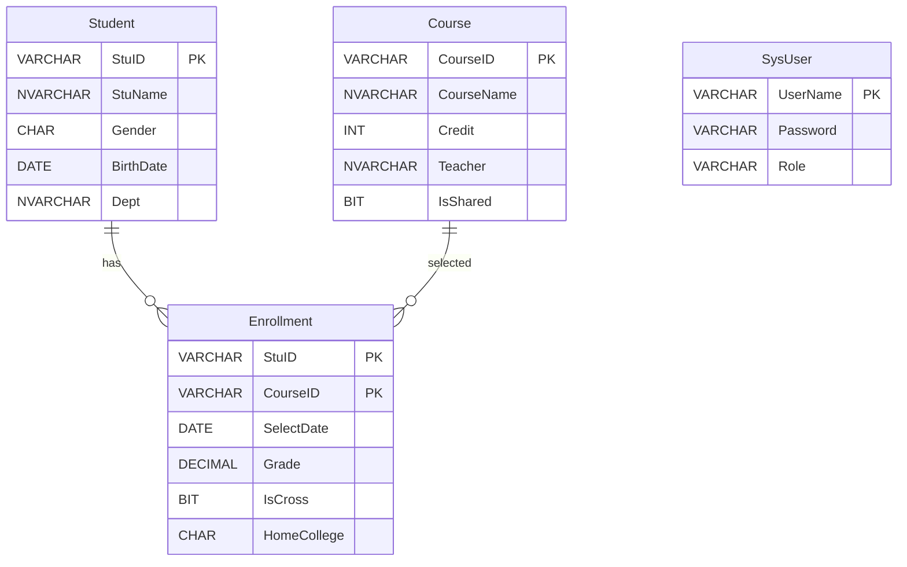
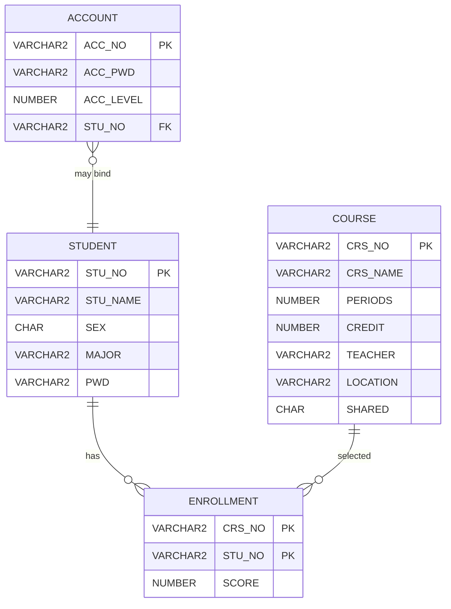
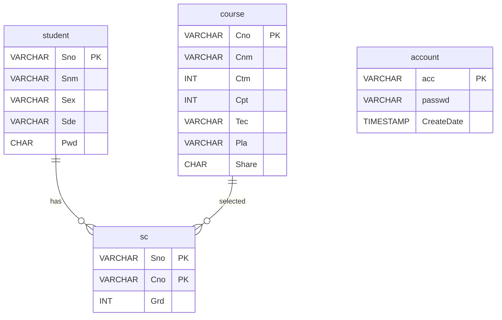
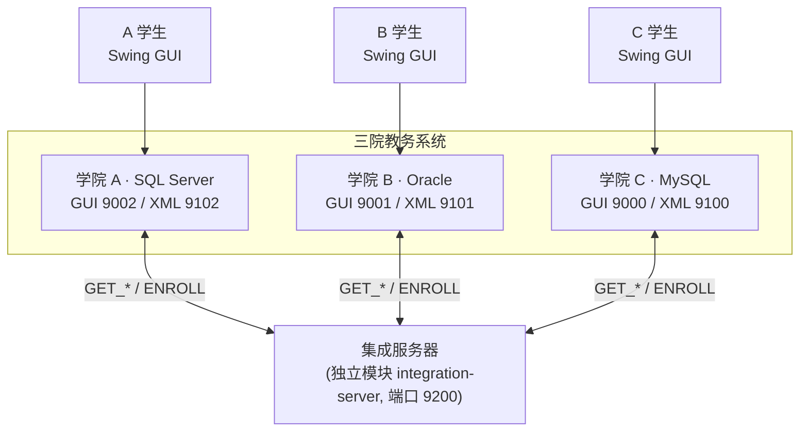
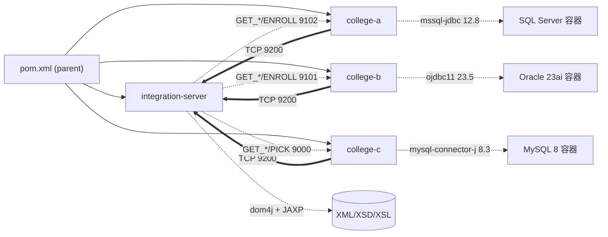
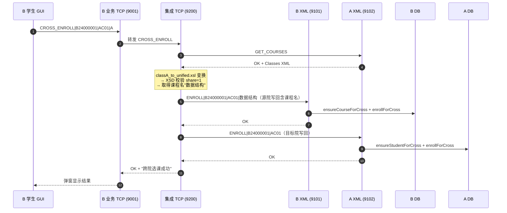
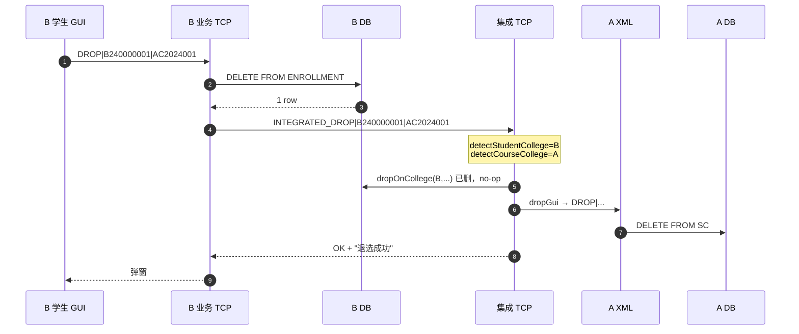
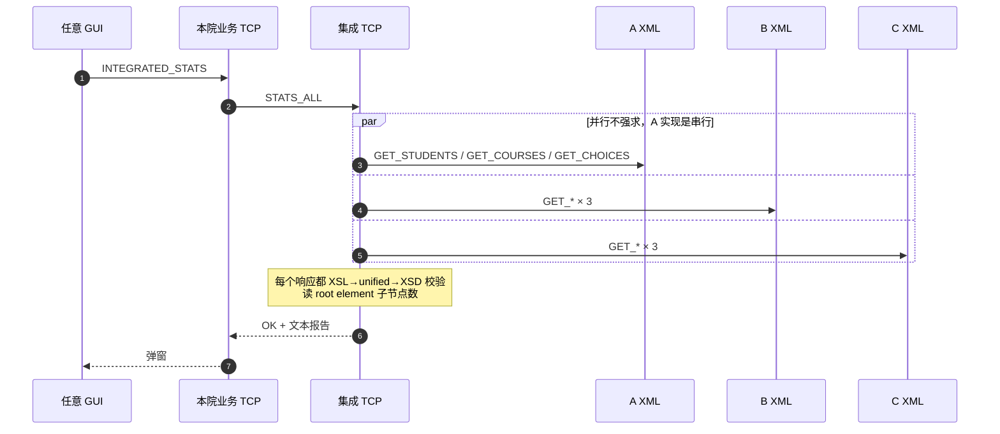
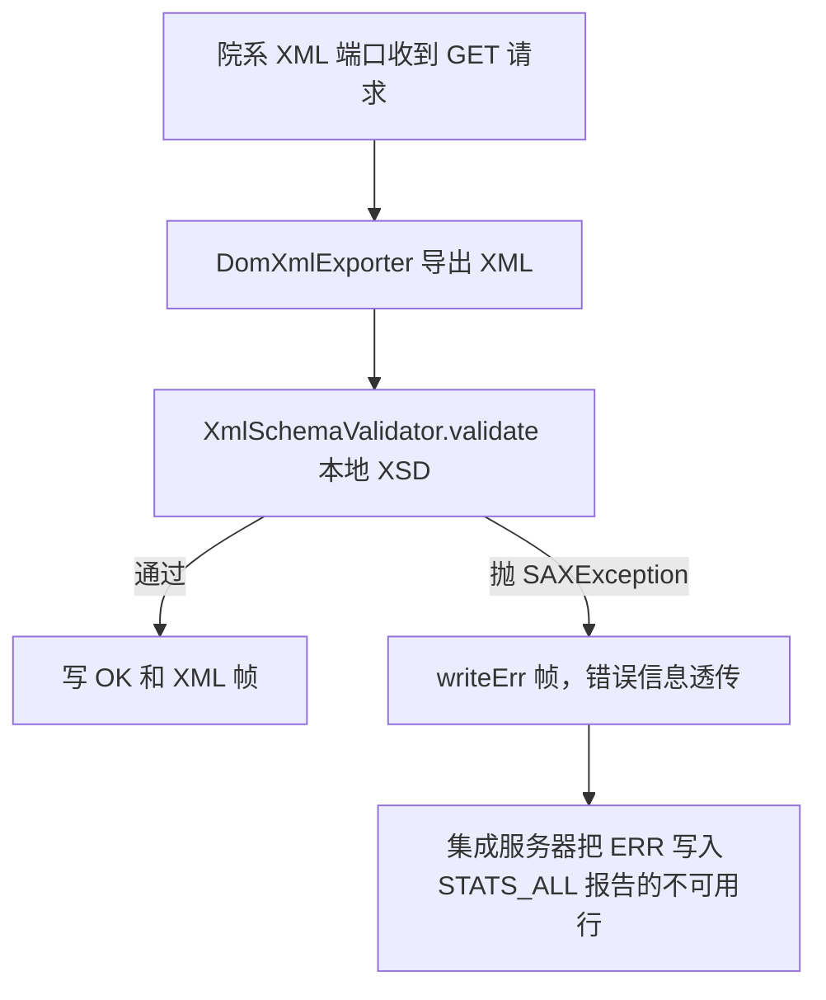

# 基于 XML 数据集成的异构教务系统—作业 3 报告

## 小组成员

马婧 231250068 
程心妍 241850152
刘汇鑫 231250106
蔡宇娇 231250139
洪梦姗 231250086
商宸溪 231250072 

## 1. 项目概述

三个学院 A/B/C 的教务系统各自独立建设：A 使用 SQL Server，B 使用 Oracle，C 使用 MySQL，表结构和字段命名均不相同。各院各管理 50 名学生和 10 门课程，学生互不覆盖，但部分课程可对外共享。本作业依据课本 3.5 节的场景，独立完成这一异构教务系统的集成实现。

集成目标是在不改动各院本地系统的前提下，通过独立的集成服务器支持跨院选课、跨院退课和全局统计三项功能。所有跨系统通信均以 XML 为数据格式，通过 XSD 校验结构合法性、通过 XSL 在各院本地格式与统一格式之间双向转换，三院均提供带登录的 Swing GUI。

---

## 2. 开发环境与技术选型

| 类别 | 选型 | 说明 |
|---|---|---|
| 语言/版本 | Java 11 + Maven 3.9 | 多模块聚合工程，父 pom 统一版本 |
| XML 构建 | DOM4J 2.1.4 | ResultSet → Document，通过 ResultSetMetaData 自动取列名为元素名 |
| XSD 校验 | JAXP `javax.xml.validation` | 双层：各院本地校验 + 集成服务器统一格式校验 |
| XSL 变换 | JAXP `javax.xml.transform` | XSLT 1.0，Transformer 薄封装 |
| 单元测试 | JUnit 5.10.2 | 集中在 integration-server 模块，15 个用例 |
| 数据库 A | SQL Server 2022 | Docker `mcr.microsoft.com/mssql/server:2022-latest` |
| 数据库 B | Oracle 23ai Free | Docker `gvenzl/oracle-free:slim` |
| 数据库 C | MySQL 8 | Docker `mysql:8` |
| JDBC 驱动 | mssql-jdbc 12.8 / ojdbc11 23.5 / mysql-connector-j 8.3 | 版本统一由父 pom `<dependencyManagement>` 管理 |
| GUI | Swing（JDK 标准库，无额外依赖） | 三院各自 LoginFrame + MainFrame，单次 TCP 调用 |

---

## 3. 数据库设计

### 3.1 三院字段对照

| 概念 | 院 A (SQL Server) | 院 B (Oracle) | 院 C (MySQL) | 规范格式（unified） |
|---|---|---|---|---|
| 学号 | `Student.StuID` VARCHAR(9) | `STUDENT.STU_NO` VARCHAR2(9) | `student.Sno` VARCHAR(9) | `<id>` (xs:string) |
| 学号前缀 | `A` | `B` | `C` | — |
| 学生姓名 | `StuName` VARCHAR(10) | `STU_NAME` VARCHAR2(10 CHAR) | `Snm` VARCHAR(10) | `<name>` |
| 性别 | `Gender` CHAR(1) | `SEX` CHAR(1) | `Sex` VARCHAR(1) | `<sex>` |
| 专业/院系 | `Dept` VARCHAR | `MAJOR` VARCHAR2(16 CHAR) | `Sde` VARCHAR(6) | `<major>` |
| 密码 | — | `PWD` VARCHAR2(6) | `Pwd` CHAR(6) | — |
| 课号 | `Course.CouID` VARCHAR(9) | `COURSE.CRS_NO` VARCHAR2(5) | `course.Cno` VARCHAR(9) | `<id>` (9 位规范长度) |
| 课时 | `Cou_period` INT | `PERIODS` NUMBER(3) | `Ctm` INT | `<time>` xs:int |
| 学分 | `Cou_credit` INT | `CREDIT` NUMBER(1) | `Cpt` INT | `<score>` xs:int |
| 共享标志 | `Cou_share` BIT/INT | `SHARED` CHAR(1) '0/1' | `Share` ENUM/CHAR | `<share>` |
| 选课表 | `SC(StuID, CouID, Grade)` | `ENROLLMENT(STU_NO, CRS_NO, SCORE)` | `sc(Sno, Cno, Grd)` | `<choice><sid/><cid/><score/></choice>` |
| 选课表 PK | (StuID, CouID) | (STU_NO, CRS_NO) | (Sno, Cno) | — |
| 字符集 | UTF-16 (NVARCHAR 推荐) | UTF-8 + `VARCHAR2(N CHAR)` 字符语义 | utf8mb4 | UTF-8 |

> **关键异构点**：(1) 字段名完全不同；(2) 课号长度 4/5/9 不一致；(3) Oracle 字符语义需显式声明 `CHAR` 单位避免 UTF-8 中文 3 字节超长。

### 3.2 ER 图

#### 计算机学院A（SQL Server）




#### 化学学院 B（Oracle）




#### 院系 C 软件学院（MySQL）




三院共同特征：1 个学生表 + 1 个课程表 + 1 个选课关系表，选课表均用复合主键 (学号 PK + 课号 PK)。异构点全在字段命名 / 类型 / 字符集 / 课号长度上，见 §3.1 对照表。

### 3.3 共享课定位

院 A/B 各前 5 门（`AC01–AC05`、`B0001–B0005`）标记为共享，院 C 共 6 门（`C001/C002/C004/C006/C008/C010`）标记为共享。跨院选课只能选目标院里 `share=1` 的课。集成服务器在 `CrossEnrollService.fetchCourseName` 中取课程 XML、经 XSL 变换到规范格式后，用 XPath 查 `<share>1</share>` 确认共享资格。

---

## 4. XML 集成方案

### 4.1 总体架构



### 4.2 协议设计 — `XmlFrameProtocol`

最简单的行协议 + XML 帧：

```
请求方:    <CMD>|<arg1>|<arg2>...\n
响应方OK:  OK\n<XMLBEGIN>\n<payload>\n<XMLEND>\n
响应方ERR: ERR|<message>\n
```

ENROLL 写回因为只回执行结果，简化为 `OK\n`（无 XML 帧）。

### 4.3 命令清单

**院系 TCP（业务）端口**（三院命令一致，端口分别 9002/9001/9000）：

| 命令 | 入参 | 出参 | 备注 |
|---|---|---|---|
| `LOGIN` | sno/admin, pwd | STUDENT\|sno 或 ADMIN\|admin | |
| `LIST_COURSES` | — | 多行 `cno\|name\|...` | |
| `MY_SC\|sno` | — | 多行 `sno\|cno\|score\|name` | |
| `PICK\|sno\|cno` | — | OK 或 FAIL | 复合 PK 唯一（已选过同门课返回 FAIL） |
| `DROP\|sno\|cno` | — | OK 或 FAIL | 同时发 INTEGRATED_DROP 给 9200（合并阶段修正） |
| `STATS_LOCAL` | — | `stu#\|course#\|enroll#` | |
| `INTEGRATED_STATS` | — | 转发 STATS_ALL 给 9200 | |
| `CROSS_ENROLL\|sno\|cno\|target` | — | 转发给 9200 | C 在合并阶段补齐 |

**院系 XML 端口**（三院一致，端口分别 9102/9101/9100）：

| 命令 | 出参 | 用于 |
|---|---|---|
| `GET_STUDENTS` | `Students` XML（本地 schema） | 集成统计 + 跨院校验 |
| `GET_COURSES`  | `Classes` XML | 共享课定位 |
| `GET_CHOICES`  | `Choices` XML | 统计 |
| `ENROLL\|sno\|cno[|courseName]` | OK / ERR | 跨院选课写回，三院均支持；可选第 4 段传递真实课程名，供源院 MY_SC 显示 |

**集成服务器端口 9200**：

| 命令 | 实现位置 | 说明 |
|---|---|---|
| `STATS_ALL` | `StatsAggregator.buildAllCollegesReport` | 三院汇总 |
| `CROSS_ENROLL\|sno\|cno\|target` | `CrossEnrollService.crossEnroll` | 共享判定 + 双向写回 |
| `INTEGRATED_DROP\|sno\|cno` | `CrossEnrollService.integratedDrop` | 源院 + 开课院双删 |

### 4.4 规范（unified）XML 格式

三类对象统一为：

```xml
<Students>
  <student>
    <id>...</id><name>...</name><sex>M|F</sex><major>...</major>
  </student>
</Students>

<Classes>
  <class>
    <id>9 位规范课号</id><name/><time xs:int/><score xs:int/>
    <teacher/><location/><share>0|1</share>
  </class>
</Classes>

<Choices>
  <choice><sid/><cid/><score xs:int/></choice>
</Choices>
```

规范格式 XSD 只放在 `integration-server/src/main/resources/xsd/integration/format{Student,Class,Choice}.xsd`，由集成服务器统一校验。

### 4.5 各院本地 XSD

| 院 | 路径 | 文件 |
|---|---|---|
| A | `college-a/src/main/resources/xsd/college-a/` | `studentA.xsd`、`classA.xsd`、`choiceA.xsd`（A 院 SysUser 表不走 XML，故无 accountA.xsd） |
| B | `college-b/src/main/resources/xsd/college-b/` | `studentB.xsd`、`classB.xsd`、`choiceB.xsd` |
| C | `college-c/src/main/resources/xsd/college-c/` | `studentC.xsd`、`classC.xsd`、`choiceC.xsd` |
| 集成服务器 | `integration-server/src/main/resources/xsd/integration/` | `formatStudent.xsd`、`formatClass.xsd`、`formatChoice.xsd`（规范格式，跨院唯一事实源） |

`DomXmlExporter` 用 `ResultSetMetaData.getColumnLabel()` 自动用列名作 XML 元素名，所以 XSD 元素名即列名。

各院 `XmlSchemaValidator` 在 `GET_STUDENTS/COURSES/CHOICES` 响应前对自家 XML 做本地 XSD 校验，校验失败回 `ERR|...`。集成服务器侧的 `XmlValidator`（Student 2 提供）在收到院系 XML 并经 XSL 变换为规范格式后再次校验，双层把关。

### 4.6 XSL 双向映射

所有 XSL 统一放在 `integration-server/src/main/resources/xsl/integration/`，由集成服务器加载，避免各院模块保留副本后产生漂移。

关键技巧：**课号长度对齐**。规范格式课号 9 位，本地 B 是 5 位、C 是 4 位。

```xslt
<!-- classB_to_unified.xsl: 5 位 → 9 位左补零 -->
<xsl:template match="course">
  <class>
    <id><xsl:value-of select="concat('0000', CRS_NO)"/></id>
    ...
  </class>
</xsl:template>

<!-- unified_to_classB.xsl: 9 位 → 5 位右截 -->
<id><xsl:value-of select="substring($id9, string-length($id9) - 4)"/></id>
```

C 院类似，`concat('00000', Cno)` 把 4 位补到 9 位。

性别字段三院都用 `M/F` 值域，无需 XSL 映射。共享标志 `0/1` 字符串值域也一致。

---

## 5. 系统实现

### 5.1 模块依赖图



父 pom 用 `<dependencyManagement>` 统一 `dom4j` / `jaxen` / `JUnit` 版本。`integration-server` 模块**不**依赖任何 JDBC 驱动，只走 TCP/XML 通道与三院通信。各子模块只声明 `groupId+artifactId`，版本号统一在父 pom。

### 5.2 集成服务器（独立模块 integration-server）

`integration-server/src/main/java/cn/nju/dataintegration/integration/`：

- **`IntegrationApplication`** — main 入口，独立 JVM 启动
- **`IntegrationTcpServer`** — 端口 9200，命令路由（一个 switch）
- **`CrossEnrollService`** — `crossEnroll` 与 `integratedDrop` 的核心实现，靠学号前缀判定源院，靠课号长度/前缀判定开课院（`detectStudentCollege` / `detectCourseCollege`）
- **`StatsAggregator`** — `buildAllCollegesReport` 串行调用三院 XML 端口，每次响应都过 XSL 变到规范格式 + XSD 校验，最后汇总条数
- **`XsltTransformer`** — `javax.xml.transform.Transformer` 的薄封装
- **`RemoteCollegeClient`** — 调用院系 XML 端口的客户端（`fetchXml` / `enrollXml` / `pickGui` / `dropGui`）
- **`validator/XmlValidator`** — Student 2 提供的 XSD 校验组件；被 StatsAggregator 在 XSL 变换后调用

集成服务器是与 A/B/C 平级的第四个独立 Maven 模块，**不**绑定任何 DBMS（无 JDBC 依赖），可独立部署。这次拆分（相对初版"嵌入 college-a 进程"）解决了"A 离线则集成功能整体停摆"的旧瓶颈。

### 5.3 三院 TCP 服务器

每院 `cn.nju.dataintegration.collegeX.net.CollegeXTcpServer`，模板一致：

```
ServerSocket → accept loop → new Thread(handle)
  handle 内 readLine → 按 "|" 拆 → switch 命令 → 调 Repo → 写帧
```

错误统一抛 SQLException / IOException → 顶层 catch 翻 `XmlFrameProtocol.writeErr`。

### 5.4 三院 XML 服务器

`CollegeXTcpServer` 的姐妹文件 `XmlTcpServer`，端口 9102/9101/9100。
导出 XML 走 `DomXmlExporter.exportXxx` —— 一段 JDBC 查询 + DOM4J `addElement` 循环 + `ResultSetMetaData` 取列名。
导出后立即过本地 XSD 校验（`xsd/college-X/`）。

### 5.5 GUI

每院 `gui/` 下有：
- `LoginFrame` — 单纯账号/密码框 + LOGIN
- `MainFrame` — JTable 显示课表 / 选课表，FlowLayout 工具栏放按钮
- `CollegeXClient` — `call(cmd)` 单次 socket，统一进出口

合并阶段：C 院的 `MainFrame` 补了"跨院选课"输入框 + JComboBox(A/B) + 按钮。
B 院本来就有 JComboBox(A/C)。A 院 GUI 也有跨院选课入口。三院"退课"按钮在合并后均触发集成退课。

---

## 6. 关键流程图

### 6.1 跨院选课时序



### 6.2 集成退课时序



### 6.3 集成统计时序



### 6.4 XSD 校验失败处理



---

## 7. 测试与验证

### 7.1 单元测试

当前测试集中在 integration-server，总计 15 个用例，`mvn test` 一次跑全：

| 模块 | 测试类 | 用例数 | 覆盖 |
|---|---|---|---|
| integration-server | `XmlValidatorTest` | 7 | unified Students/Classes/Choices 的正例 + 反例（缺必填元素、根元素拼错、time 非整数） |
| integration-server | `XsltMappingTest` | 4 | A/B/C 到统一格式的字段映射，以及 C 课程 roundtrip |
| integration-server | `CrossEnrollServiceTest` | 4 | 学号/课号到学院的路由规则和异常分支 |

跑法：

```powershell
cd integrated-edu
mvn -q test
```

期望输出（节选）：

```
Running cn.nju.dataintegration.integration.validator.XmlValidatorTest
Tests run: 7, Failures: 0, Errors: 0, Skipped: 0
Running cn.nju.dataintegration.integration.XsltMappingTest
Tests run: 4, Failures: 0, Errors: 0, Skipped: 0
Running cn.nju.dataintegration.integration.CrossEnrollServiceTest
Tests run: 4, Failures: 0, Errors: 0, Skipped: 0
BUILD SUCCESS
```

### 7.2 联调用例

#### TC1 — 本院选课与退课

**操作**：B 院学生 B24000001 登录 → 输入本院课号 → 点击"本院选课" → 再点击"退课"

**期望**：B.ENROLLMENT 表条数依次 +1、-1

**实际截图**：


---

#### TC2 — 跨院选课（B 学生选 A 共享课）

**操作**：B 院学生 B24000001 → 主界面输入 A 院共享课号 → 下拉选"A" → 点击"跨院选课"

**期望**：弹窗显示"跨院选课成功"；A.SC 新增一条学号前缀为 B 的记录；B.ENROLLMENT 同时新增记录（双写）

**实际截图**：


---

#### TC3 — 外院占位学生（C 学生选 B 共享课）

**操作**：C 院学生 C20240001（密码 000000）→ 跨院选 B 院共享课

**期望**：B.ENROLLMENT 新增一条 STU_NO 前缀为 C 的记录（`ensureStudentForCross` 自动插入占位学生）

**实际截图**：


---

#### TC4 — 集成退课（B 学生退跨院 A 课）

**操作**：B 院学生选中已跨院选的 A 课 → 点击"退课"

**期望**：B.ENROLLMENT 和 A.SC 两侧记录均被删除

**实际截图**：


---

#### TC5 — 集成统计

**操作**：任一院管理员登录 → 点击"集成统计(全院)"

**期望**：弹窗显示三院汇总（学生 ≈ 150、课程 ≈ 30、选课 ≈ 750）

**实际截图**：


---

#### TC6 — XSD 校验失败处理（可选）

**操作**：在 DBeaver 中手动将 B 院某学生 STU_NAME 改为超长字符串 → 点击"集成统计"

**期望**：B 院 GET_STUDENTS 回 `ERR|...`；集成统计报告中 B 院显示"不可用"，A/C 正常

**实际截图**：


### 7.3 错误处理验证

- 集成服务器（9200）离线时 → B/C 的 CROSS_ENROLL / INTEGRATED_STATS 按钮 → 弹"集成服务不可用: Connection refused"，本地操作不受影响
- 跨院选不存在的课号 / 非共享课 → 集成服务器返回"目标学院 X 不存在共享课程 Y"
- XSD 校验失败 → 见 6.4

---

## 8. 异构难点与解决

### 8.1 字段命名 / 大小写差异
SQL Server 默认大小写不敏感，Oracle 标识符默认大写、MySQL 默认按 OS（Windows 不敏感、Linux 敏感）。我们规定 **所有 JDBC SQL 都按各院 schema 严格大小写写**，并在 XSL 里用 schema 实际列名匹配。

### 8.2 课号长度统一
4 / 5 / 9 位三种长度。规范格式定 9 位 → 用 `concat('0000'/'00000', native_id)` 补零、反向 `substring` 截取，保证唯一性同时方便跨表对比。

### 8.3 字符编码
Oracle `VARCHAR2(N)` 默认 BYTE 语义，存中文（UTF-8 3 字节）易超长。我们显式写 `VARCHAR2(N CHAR)` 切换到字符语义。所有 JDBC URL 显式 `characterEncoding=utf8` / `serverTimezone=Asia/Shanghai`（MySQL）/ Oracle 通过 NLS 自动协商。Windows IntelliJ 改 UTF-8 默认带 BOM，曾导致编译器 `非法字符 ''`，统一选 "No BOM"。

### 8.4 跨院学生 / 课程 FK

三院 ENROLLMENT/sc 表都有 FK → STUDENT 和 FK → COURSE。集成服务器跨院写回时，学生和课程都可能不在目标/源院本地表里：

- **`ensureStudentForCross(sno)`**：写 ENROLLMENT 前先检查 STUDENT，不存在则插占位记录（姓名用 sno、专业"外院"、密码 000000）。
- **`ensureCourseForCross(cno, courseName)`**：同理处理课程 FK；若课程不存在则以真实课程名插占位记录（由集成服务器通过目标院 unified XML 取名后随 ENROLL 命令传递）；若已存在占位名（"外院"等）则更新为真实名。

C 院原 `course.Cno CHAR(4)` 无法存 5 位 B 院课号，已扩为 `VARCHAR(9)` 统一支持 6 种跨院方向。

### 8.5 端口占用
合并前 College C 自启了一个 IntegrationTcpServer（半成品）也占用 9200，与 A 冲突。合并时注释掉 C 的 `new Thread(IntegrationTcpServer ...)`，并删除 C 模块下的 IntegrationApplication/IntegrationTcpServer/StatsAggregator 死代码（保留 XsltTransformer 因为 C 的 JUnit 测试依赖它）；集成服务器拆为独立模块 `integration-server`，由它独占 9200。


## 9. 部署与启动

### 9.1 前置依赖

- JDK 11+，Maven 3.6+，Docker Desktop（三个 DB 容器各自在独立端口）
- Windows 以管理员权限运行 PowerShell（脚本需 `-ExecutionPolicy Bypass`）

### 9.2 启动步骤

```powershell
# 1. 启动三个 DB 容器（已存在则复用）
.\scripts\start-dbs.ps1

# 2. 首次加载 schema + seed 数据（50 学生 / 10 课程 / 250 选课 × 3 院）
.\scripts\load-schemas.ps1

# 3. 编译全项目
mvn -q clean package -DskipTests

# 4. 四个终端依次启动（集成服务器须最先就绪）
mvn -pl integration-server exec:java -Dexec.mainClass=cn.nju.dataintegration.integration.IntegrationApplication
mvn -pl college-a exec:java -Dexec.mainClass=cn.nju.dataintegration.collegea.CollegeAApplication
mvn -pl college-b exec:java -Dexec.mainClass=cn.nju.dataintegration.collegeb.CollegeBApplication
mvn -pl college-c exec:java -Dexec.mainClass=cn.nju.dataintegration.collegec.CollegeCApplication
```

### 9.3 测试账号

| 学院 | 管理员账号 | 示例学生账号 | 统一密码 |
|---|---|---|---|
| A | admin / admin123 | A20240001 | 123456 |
| B | admin / admin123 | B24000001 | 123456 |
| C | admin / admin888888 | C20240001 | 000000 |

---

## 10. 结论与不足

### 10.1 完成情况

- ✅ 异构 DBMS 三套独立工程
- ✅ XML 帧协议 + XSD 校验 + XSL 双向映射
- ✅ 跨院选课双写
- ✅ 集成退课（INTEGRATED_DROP）
- ✅ 集成统计（STATS_ALL）
- ✅ GUI 登录 + 主界面，含跨院按钮
- ✅ Maven 聚合工程一键编译
- ✅ 独立集成服务器模块（integration-server，端口 9200，无 JDBC 依赖）

### 10.2 不足与改进

- 集成服务器虽已独立模块部署，但 A/B/C 之间仍按学号前缀硬编码识别，扩展到第 4 个学院需要改 `CrossEnrollService.detectStudentCollege`；生产场景应该走配置 / 注册中心。
- `RemoteCollegeClient` 没有连接池，每次跨院调用新开 socket；对小规模演示足够，生产场景应该用 Netty / 长连接。
- XSL 1.0 没有 `xsl:function`，复杂字段映射只能写 template，重用度低。未来可升 XSLT 2.0 + Saxon。
- 没有事务跨院二阶段提交：若集成服务器在写 A 之后、写 B 之前崩溃，会出现 A 有 SC、B 无 SC 的脏状态。课程作业不强求 2PC，但生产场景必须考虑。
- 单元测试覆盖业务逻辑薄：3 套 15 用例集中在 XSL/XSD 校验链路，CrossEnrollService 跨院判定、Repo 层 ensureStudentForCross 等业务路径暂时只靠手工联调验证。

---

## 11. 参考文献

1. *数据集成原理与应用*. 第 3 章 § 3.5（教材 P74-P76 的三院 schema 示例）.
3. DOM4J Documentation. <https://dom4j.github.io/>.
4. JAXP Reference. Oracle JDK 11 API.
5. XML Schema Part 0/1/2 W3C Recommendation. <https://www.w3.org/TR/xmlschema-0/>.
6. XSLT 1.0 W3C Recommendation. <https://www.w3.org/TR/xslt-10/>.
7. Maven 3 — *Multi-module Projects*. <https://maven.apache.org/guides/mini/guide-multiple-modules.html>.
8. *gvenzl/oracle-free* Docker image. <https://github.com/gvenzl/oci-oracle-free>.

---

## 附录 A — 仓库地址与启动命令

GitHub：<https://github.com/Yaelnju/integrated-edu>

```powershell
git clone <repo>
cd integrated-edu
powershell -ExecutionPolicy Bypass -File scripts/start-dbs.ps1
# 执行各院 sql/01_schema.sql + 02_seed.sql
mvn -q install    # 全模块编译
# 三窗口：mvn -q -pl college-a exec:java / -pl college-b / -pl college-c
```

## 附录 B — 截图

截图文件存放于 `docs/screenshots/`，命名规则：`编号-说明.png`。

### 登录与主界面


### 跨院选课操作


### 数据库状态


> 联调用例 TC1–TC6 的截图已内嵌于 §7.2 各用例内。
